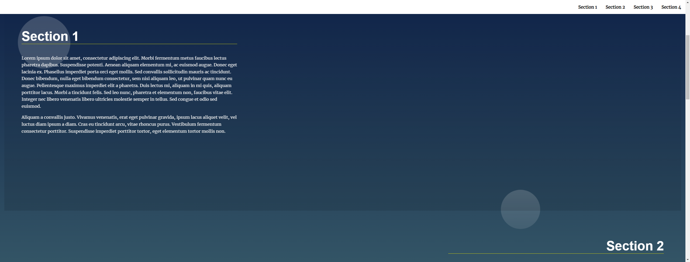
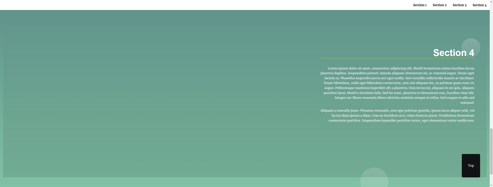

# Landing Page Project

----------------------------------------

[Software Name] Landig Page (Javascript, HTML, CSS)  
[System Requirement] Windows 10  
[Version] 1.00  
[Last updated] 9/05/2023

----------------------------------------

## About this project
This project aims to learn real-world scenarios of manipulating the DOM.

In this project, I have added the code in the JavaScript file that creates the fixed navigation bar. The navigation bar will be invisible whilte not scrolling or mouse moving, or the user is not touching smartphone screen. Once the navigation bar is visible, it will become invisible again after 4 seconds of user's action.  

I made a button that will go to top of the page, only visible when the user scrolls below the fold of the page.
