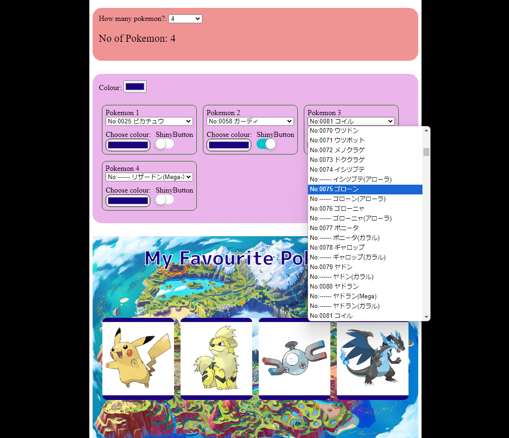
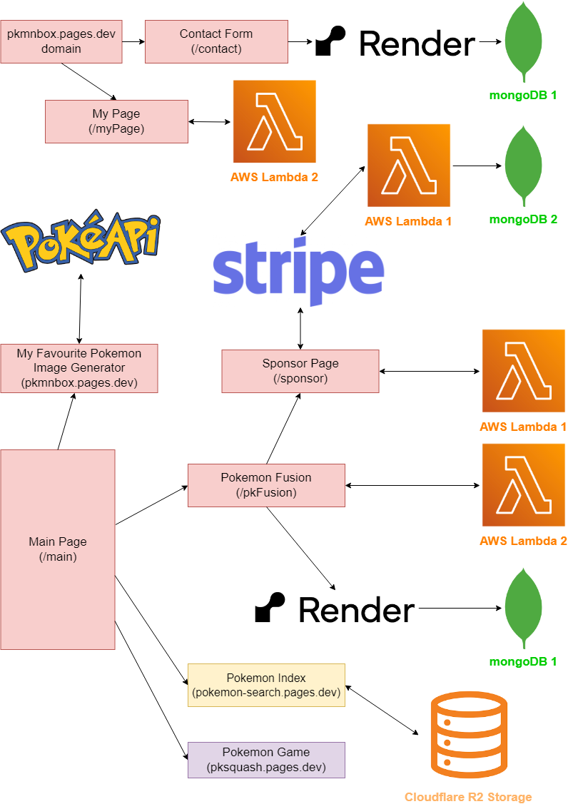

# Full-stack web application (My Favourite Pokemon Generator)

---

[Software Name] Pokemon Navi  
[System Requirement] Windows 10  
[Version] 5.27  
[Last updated] 01/10/2024

---

# Overview

This is a full-stack web application built with MongoDB, Express.js, React.js, and Node.js. It features four fun pages (Pokémon Image Generator, Pokémon Fusion, Pokémon Index, and Pokémon Game) for all Pokémon lovers. By implementing user authentication and account creation using Node.js, logged-in users can access exclusive features. The app also includes a secure payment system with Stripe, enabling users to make seamless transactions.

# URL

English Version: https://portfolio-myfavourite-pokemongenerator.pages.dev/  
Japanese Version : https://pkmnbox.pages.dev/main  
※ Please log in by typing 'kohki.martinez@gmail.com' into the input box and then pressing Enter. (https://pkmnbox.pages.dev/myPage)
※ For downloading images from the 'Pokemon Image Generator' page, please use Safari instead of Google Chrome on iOS devices. There are no issues with Android phones or PCs.

# About this project

## Flowchart

- Contact form page and My Page can both be accessed from the domain pkmnbox.pages.dev. (Open the hamburger menu in the top right.)
- Contact Form Page
  - It receives messages from users and sends them to render.com. The backend code then sends me a notification immediately, and these user messages are stored in MongoDB 1.
- My Page
  - Each time a user accesses "My Page," the backend code, using AWS Lambda 2, checks if the user is logged in. It also functions as an authentication checker when users input their email address and press enter.
- Main Page
  - The main page contains four different sections: Pokémon Image Generator, Pokémon Fusion, Pokémon Index, and Pokémon Game.
- My Favourite Pokemon Image Generator page

  - It extracts image data from API called PokeAPI. https://pokeapi.co/

- Pokemon Fusion
  - AWS Lambda 2 checks if the user is logged in whenever they access this page. If they are logged in, they can access special functions.
  - When users submit a Pokémon fusion name request, it is sent to render.com, and I am notified immediately. These user requests are stored in MongoDB 1.
- Sponsor Page
  - To create an account and use special features, users need to pay via Stripe. When the payment is successful, it triggers a webhook function that notifies me. User information is stored in MongoDB 2.
- Pokemon Index Page
  - This page is hosted on a different domain. All images are stored in Cloudflare R2 storage.
- Pokemon Game Page
  - This page is also hosted on a different domain.

## What is this web app

This web app is designed for Pokémon fans. It currently includes four fun pages, but I plan to add more in future updates.

In the Pokémon Image Generator, users can create images of their favorite Pokémon. The page includes all Pokémon up to No. 1017. Users can also choose Mega Pokémon, G-Max Pokémon, or Pokémon from different regions from the list. There are shiny buttons available, allowing users to turn Pokémon into their shiny versions with just one click. This web app is primarily targeted at people in Japan, as many of them post "Pokémon resumes" on X (formerly Twitter) to showcase their favorite Pokémon to their followers. You can find these posts by searching #ポケモン履歴書 on X.

## Why did you make it

There are other Pokémon image generators, but I felt that none were user-friendly enough. For instance, many require users to select 18 Pokémon, one for each type, which can be overwhelming for beginners who might only have 6 favorites. These tools often don’t allow users to save their images unless they select all 18 types. Another issue is the added text on the images. I felt that saying "My Favorite Pokémon" sounds better than "Your Favorite Pokémon," so I set "My Favourite Pokémon" as the default in Japanese (私のお気に入りポケモン). I also included Mega, G-Max, and regional forms in the dropdown list, as this was a common user request.

## Features

- Customizable number of Pokémon:

  - Users can choose how many favorite Pokémon to include, from as few as 3 to as many as 18.

- Mega, G-Max, and regional forms:

  - These forms are included because they often rank among users' favorite Pokémon.

- Shiny button:

  - Users can make their Pokémon shiny with the press of a button, as shiny Pokémon are sometimes more appealing.

- Frame color customization:

  - Users can change the color of the image frame. For example, if they select 18 fire-type Pokémon, the frames can be set to fire-related colors like red, orange, or yellow. If all the selected Pokémon are water-type, the frame color can be blue. Users can change this color through a dropdown in the top left corner.

- Customizable text and color:
  - Users can modify the text and its color on the image. Emojis can be added, and users also have the option to leave the text blank.

## Challenges

This app uses PokeAPI to fetch data, but the API only supports English. To provide a Japanese translation, I decided to use a JSON file. While I was able to scrape Pokémon data from other websites, not all the information I needed was available, so I had to manually input the remaining data. This manual data entry was the longest and most difficult part of the project.

<!-- Another hurdle in this project is marketing. Even though I created an account on X and introduced my web app to followers, none of them have used the service yet. It's only been three months since I started managing X, so I plan to keep promoting this web app to a broader audience through tweets. According to Cloudflare web analysis, an average of 200 people access this web app per day. -->

## Future Update

1. Allow users to choose a background image.  
   The default background image is from Pokémon Scarlet and Violet (SV). However, some people play other Pokémon series, such as Pokémon X and Y or Pokémon Diamond and Pearl. Therefore, I plan to add more Pokémon background images or allow users to upload their own images as background options in future updates.

1. Add a Pokémon icon in the box after users select their Pokémon.  
   This will make it easier for users to see whether they've chosen a Pokémon. Currently, the box color changes from pink to green after users select their Pokémon.

1. Include other versions of Pokémon images.  
   At the moment, users can only choose official Pokémon images. Since some users play older Pokémon series, I want to add different versions of Pokémon images for those players.

1. Add blogs, articles, and news.  
   I want to attract more Pokémon fans to visit this web app. Instead of only allowing them to create Pokémon images, I want to encourage users to visit regularly. To achieve this, I plan to write blogs about Pokémon and add relevant articles and news.

# Frameworks, Skills, Libraries

## Dependencies (Front-end)

    "@fortawesome/fontawesome-svg-core": "^6.5.1",
    "@fortawesome/free-solid-svg-icons": "^6.5.1",
    "@fortawesome/react-fontawesome": "^0.2.0",
    "devtools-detector": "^2.0.17",
    "dom-to-image": "^2.6.0",
    "html2canvas": "^1.4.1",
    "jwt-decode": "^4.0.0",
    "react": "^18.2.0",
    "react-dom": "^18.2.0",
    "react-helmet": "^6.1.0",
    "react-helmet-async": "^2.0.5",
    "react-router-dom": "^6.20.0",
    "typescript": "^5.4.5"

## Dev Dependencies (Front-end)

    "@testing-library/jest-dom": "^6.5.0",
    "@testing-library/react": "^16.0.1",
    "@types/react": "^18.2.78",
    "@types/react-dom": "^18.2.25",
    "@vitejs/plugin-react": "^4.2.0",
    "eslint": "^8.53.0",
    "eslint-plugin-react": "^7.33.2",
    "eslint-plugin-react-hooks": "^4.6.0",
    "eslint-plugin-react-refresh": "^0.4.4",
    "jest": "^29.7.0",
    "vite": "^5.0.0",
    "wrangler": "^3.48.0"

## Dependencies (Back-end)

    "body-parser": "^1.20.2",
    "cors": "^2.8.5",
    "dotenv": "^16.4.5",
    "express": "^4.19.2",
    "jsonwebtoken": "^9.0.2",
    "mongoose": "^8.5.0",
    "nodemailer": "^6.9.14",
    "nodemon": "^3.1.4",
    "serverless-http": "^3.2.0",
    "stripe": "^16.2.0"

# React + Vite

This template provides a minimal setup to get React working in Vite with HMR and some ESLint rules.

Currently, two official plugins are available:

- [@vitejs/plugin-react](https://github.com/vitejs/vite-plugin-react/blob/main/packages/plugin-react/README.md) uses [Babel](https://babeljs.io/) for Fast Refresh
- [@vitejs/plugin-react-swc](https://github.com/vitejs/vite-plugin-react-swc) uses [SWC](https://swc.rs/) for Fast Refresh
