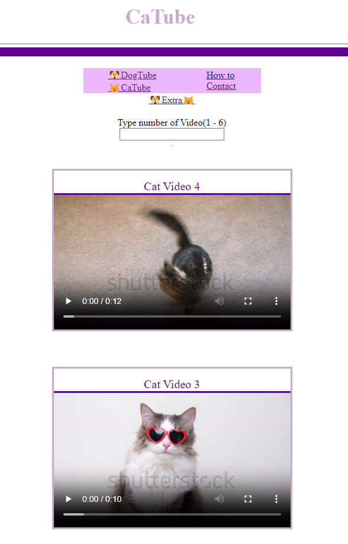
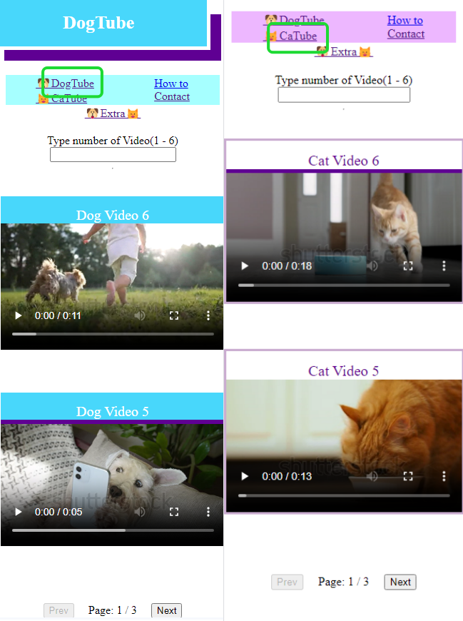
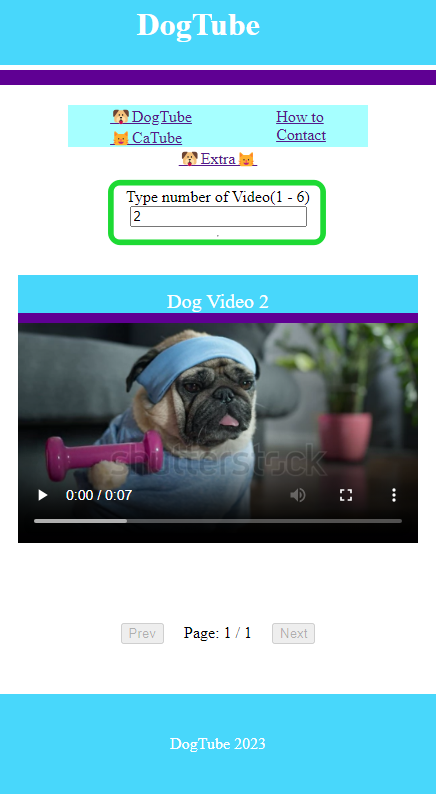
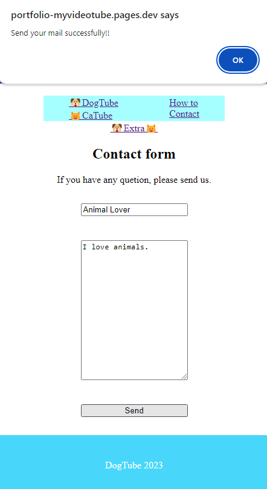
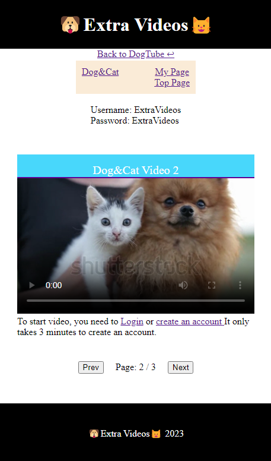
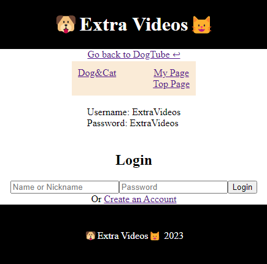
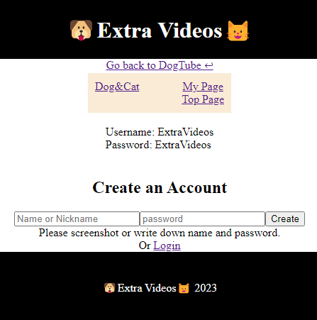

# My Video Tube  

----------------------------------------

[Software Name] My Video Tube   
[System Requirement] Windows 10  
[Version] 1.00  
[Last updated] 13/01/2024                                           

----------------------------------------

# Overview
This is 'My Video Tube', a platform where users can enjoy watching cat, dog, or both cat and dog videos.   
In the 'Extra' section, users can access even more dog and cat videos. However, for full access to all content, users are required to create an account and log in.

# URL
https://portfolio-myvideotube.pages.dev/

# About this project
## What is 'My Video Tube'
Explore 'My Video Tube' for a plethora of adorable dog and cat videos. Take a break, relax, and enjoy these heartwarming clips to unwind and destress.

## Why did you make it
I want to create a website that brings joy to users. Since many people love cats or dogs, I've decided to upload cat and dog videos, allowing anyone to watch them anytime.  
I also wanted to practice my backend skills with Node.js and MongoDB, so I added another link called 'Extra', where users need to create accounts to watch more videos.  
In the end, I feel that this project is the best opportunity to practice both frontend and backend skills, and I have gained more confidence in interacting with them.

  
## Features

|Users can switch between cat videos and dog videos by clicking the links.|Users can input numbers from 1 to 6 into the search box.|
|----|----|
|||  

|Users can send me a message through 'Contact' form.|At 'Extra Videos', users can watch more dog and cat videos.|  
|----|----|  
|||

|Users must be logged in to access all videos. Please use 'ExtraVideos' for both the username and password to log in.|Users can also create their accounts. Please note that the token will expire in 1 minute.|
|----|----|
|||

## What I struggled with
The most challenging aspect of this project is the interaction between the front end and the back end. Every time the user access to 'Extra Videos', the code checks whether the user is logged in or not. Understanding this concept can be quite difficult.

## Future Update
1. Use the transaction service 'Stripe' to make certain videos not available for free viewing.
Currently, all videos are available to watch for free. However, by implementing Stripe, we can introduce paid subscriptions for certain videos. Users would need to subscribe in order to access all videos, similar to the model used by YouTube membership.

1. Enable other users to upload their videos.
I am currently the only one able to upload videos. However, I plan to enable all users who create accounts to upload their own videos.

1. Add 'like' and 'dislike' buttons, and comment box.
I can add 'like' and 'dislike' buttons to each video, as well as a comment box where all users can discuss that video.

# Frameworks, Skills, Libraries
## Dependencies
### Frontend
    "jwt-decode": "^3.1.2",
    "prop-types": "^15.8.1",
    "react": "^18.2.0",
    "react-dom": "^18.2.0",
    "react-player": "^2.12.0",
    "react-router-dom": "^6.14.2"
### Backend
    "cors": "^2.8.5",
    "dotenv": "^16.3.1",
    "ejs": "^3.1.9",
    "express": "^4.18.2",
    "jsonwebtoken": "^9.0.2",
    "mongoose": "^7.4.4",
    "nodemailer": "^6.9.4"
## Dev Dependencies
### Frontend
    "@types/react": "^18.2.14",
    "@types/react-dom": "^18.2.6",
    "@vitejs/plugin-react": "^4.0.1",
    "eslint": "^8.44.0",
    "eslint-plugin-react": "^7.32.2",
    "eslint-plugin-react-hooks": "^4.6.0",
    "eslint-plugin-react-refresh": "^0.4.1",
    "vite": "^4.4.0"

# React + Vite

This template provides a minimal setup to get React working in Vite with HMR and some ESLint rules.

Currently, two official plugins are available:

- [@vitejs/plugin-react](https://github.com/vitejs/vite-plugin-react/blob/main/packages/plugin-react/README.md) uses [Babel](https://babeljs.io/) for Fast Refresh
- [@vitejs/plugin-react-swc](https://github.com/vitejs/vite-plugin-react-swc) uses [SWC](https://swc.rs/) for Fast Refresh

