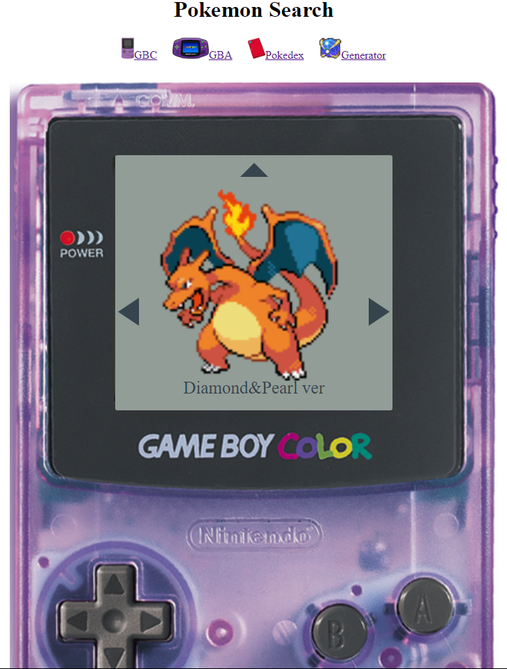
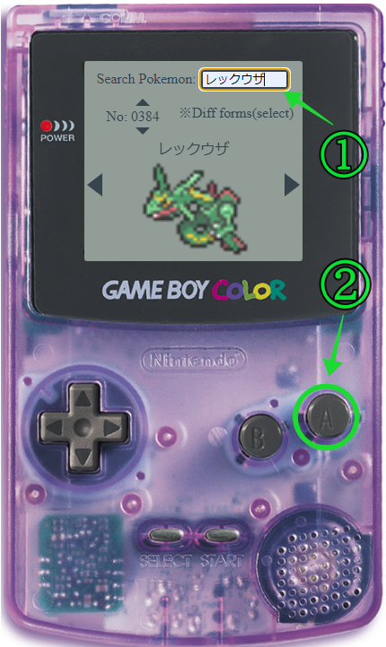
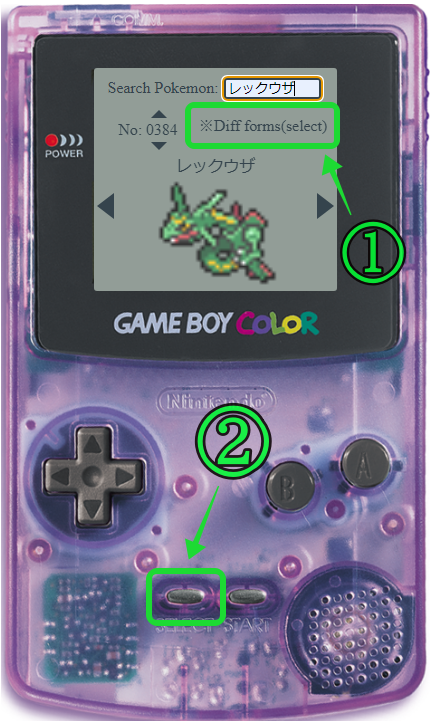
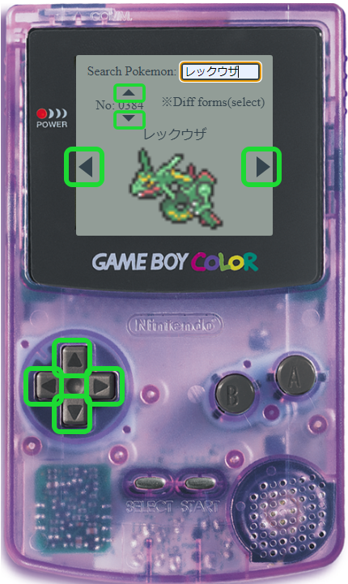
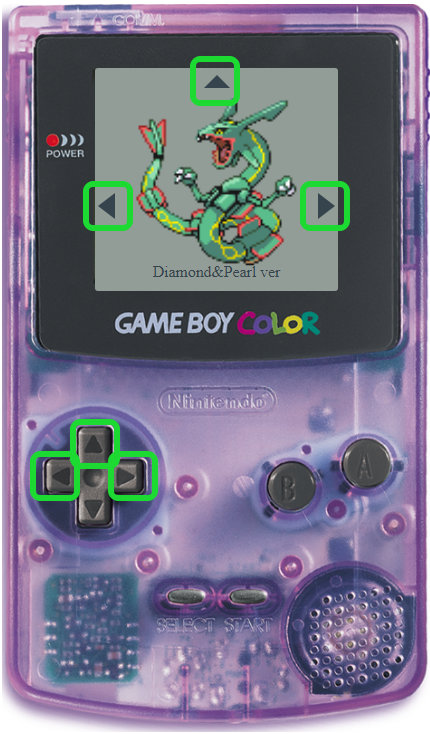
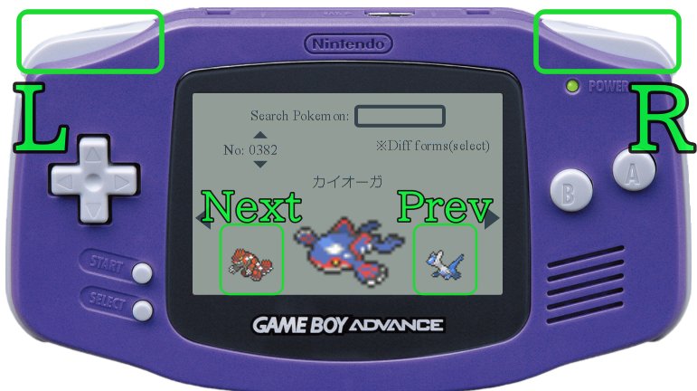
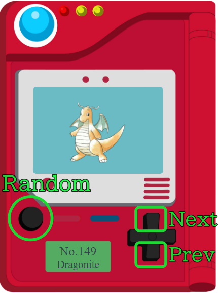

# Pokemon Search  

----------------------------------------

[Software Name] Pokemon Search   
[System Requirement] Windows 10 or later  
[Version] 2.00  
[Last updated] 20/04/2024                                           

----------------------------------------

# Overview
This is the Pokemon Index web app, an enhanced version of [pokemonIndex](https://github.com/KohkiMartinez/My-Portfolio/tree/master/JavaScript/PokedexWithReact.js).  
Users can explore images of all Pokemon (up to Pokemon No. 1017) in various versions (from red&blue to black&white) using their preferred gaming console.

# URL
https://portfolio-pokemonsearch.pages.dev/

# About this project
## What is 'Pokemon Search'
Pokemon Search is where Pokemon fans can search for Pokemon images with their favourite console. It includes all Pokemon, up to Pokemon No. 1017. Users can also search for Mega Pokemon, G Max Pokemon, or Pokemon from different regions by pressing the select button of the console. The link at the top right, 'Generator' leads users to the web site 'My Favourite Pokemon Generator'. For more information about 'My Favourite Pokemon Generator', please [check this out](https://github.com/KohkiMartinez/My-Portfolio/tree/master/JavaScript/MyFavouritePokemonGenerator).

## Why did you make it
I wanted to create something fun and exciting.
This web app was complex, and it took me a lot of time to create, but I'm so happy to have completed this app, and I feel it was great practice using React.js.
What's even more fulfilling is that I've received some feedbacks from users, and they said that this app brings back old memories.
  
## Features

|Users can search for Pokemon by entering Pokemon names in the Search Pokemon box (supports only Japanese). Then press the A button.|When a Pokemon has different forms (mega, g-max, different regional forms), 'Diff forms (select)' will appear. Press the 'select' button to change its forms.|
|----|----|
|||  

|Up, down, right, left arrows on the screen indicate which buttons are allowed to be used.All buttons have functions.|Up, left, and, right buttons have functions.|  
|----|----|  
|||

|Users can choose between GBC or GBA. While there is no difference in functionality, GBA displays 'next' and 'prev' Pokemon icons on the screen. Additionally, GBA version includes 'R' and 'L' trigger buttons|
|----|
||

|Pokedex is where users can view old images of pokemon(up to pokemon No. 151). It has 'Random', 'Next', and 'Prev' buttons. It supports English. |
|----|
||

## What I struggled with
This project is one of the most complicated projects in my portfolio. I've updated this web app multiple times to enhance its functionality. The most significant issue I encountered was 'laggy' problem. If the user goes from Pokemon Index number 40 to 41 by pressing the up button once, there was no problem, and the Pokemon images loaded quickly. However, going from Pokemon Index 40 to 140 by pressing the up button 100 times caused a 'laggy' problem. This occurred because the code fetched data 100 times, and it gave us images of Pokemon index of 139's or 138's instead of 140's (if the up button was pressed 100 times and the right or left button was pressed before fetching data was complete). I had to solve this problem because it caused stress for the users. To resolve this issue, I sought answers from Google and decided to add an 'AbortController' to cancel the fetch when the second fetch starts after the first fetch. This is the best solution, and now there are no issues if the users press the up or down button 100 times or even 100,000 times.

## Future Update
1. Add more gaming consoles.
Currently, GBC and GBA are included, and I plan to add Nintendo DS or DS Lite in future updates.

1. Add Pokemon Box.
I want to add function where users can add their favourite pokemon images in their 'Pokemon Box' and see them anytime. 

1. Combine 'Pokemon Search' and 'My Favourite Pokemon Generator'
Instead of providing a separate link for 'My Favorite Pokemon Generator', integrate the entire app to 'My Favourite Pokemon Generator'. This way, users won't feel stressed when they move from one to another.

# Frameworks, Skills, Libraries
## Dependencies
    "prop-types": "^15.8.1",
    "react": "^18.2.0",
    "react-dom": "^18.2.0",
    "react-router-dom": "^6.16.0",
    "typescript": "^5.4.5"
## Dev Dependencies
    "@types/react": "^18.2.79",
    "@types/react-dom": "^18.2.25",
    "@vitejs/plugin-react": "^4.0.1",
    "eslint": "^8.44.0",
    "eslint-plugin-react": "^7.32.2",
    "eslint-plugin-react-hooks": "^4.6.0",
    "eslint-plugin-react-refresh": "^0.4.1",
    "vite": "^4.4.0",
    "wrangler": "^3.22.1"

# React + Vite

This template provides a minimal setup to get React working in Vite with HMR and some ESLint rules.

Currently, two official plugins are available:

- [@vitejs/plugin-react](https://github.com/vitejs/vite-plugin-react/blob/main/packages/plugin-react/README.md) uses [Babel](https://babeljs.io/) for Fast Refresh
- [@vitejs/plugin-react-swc](https://github.com/vitejs/vite-plugin-react-swc) uses [SWC](https://swc.rs/) for Fast Refresh
