# ReactNative Application (RSS Reader)

---

[Software Name] RSS Reader  
[System Requirement] Latest iOS and Android  
[Version] 15  
[Last updated] 26/09/2024

---

# Overview

This is a fully functional RSS feed reading mobile application built using React Native and Expo.
It allows users to easily browse and manage their favorite news sources in a streamlined interface.
The app includes features such as efficient data fetching, a responsive design, and cross-platform compatibility for both Android and iOS.

# URL

Android: https://play.google.com/store/apps/details?id=com.github.maki.onlyOne&hl=en-US&ah=6eqWdKz4bJ_pTwoC54-CBjzLhrs

※ The app is currently in the testing stage and is only available for download on Android. I plan to release it on iOS in the future.

# About this project

## What is this web app

| By pressing the plus button at the bottom right of the screen, users are taken to the 'Add News' page. | Users can search for their favorite news by typing the name of the news into the search box. |
| ------------------------------------------------------------------------------------------------------ | -------------------------------------------------------------------------------------------- |
| 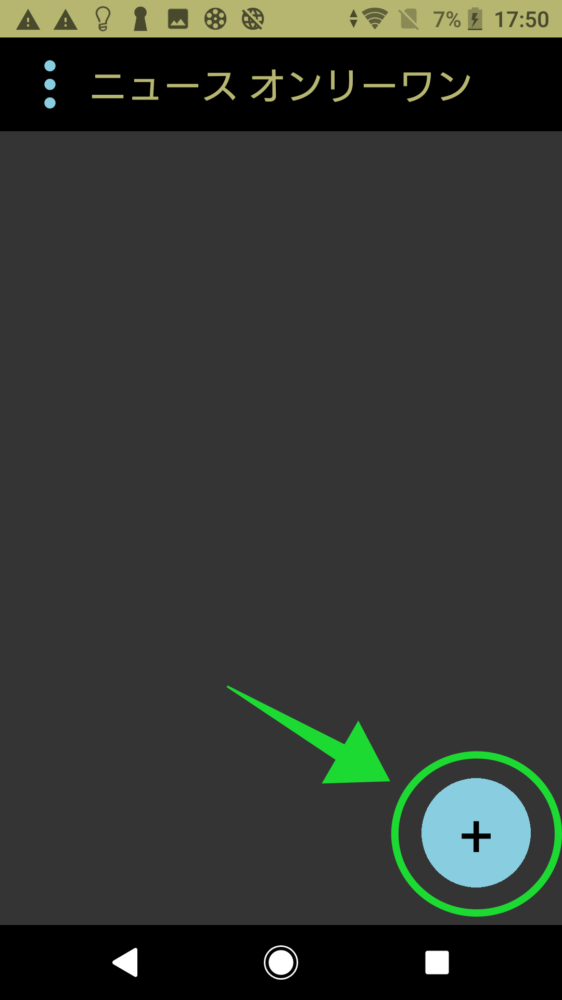                                                               | 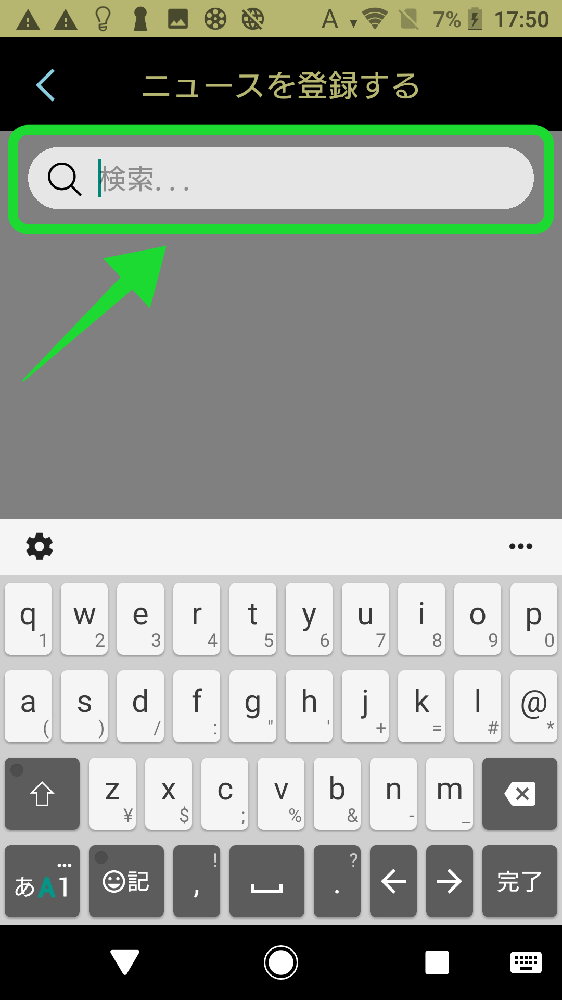                                                     |

| If you type 'a' into the search box, all news items that include 'a' will be shown. | All added news will appear on the main page. Users can also remove news by swiping each item to the left. |
| ----------------------------------------------------------------------------------- | --------------------------------------------------------------------------------------------------------- |
| 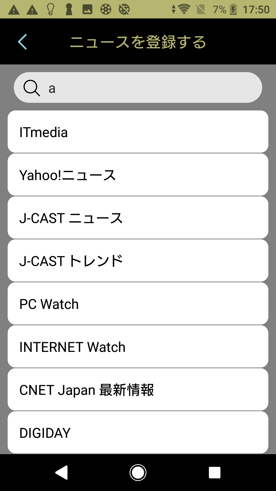                                            | 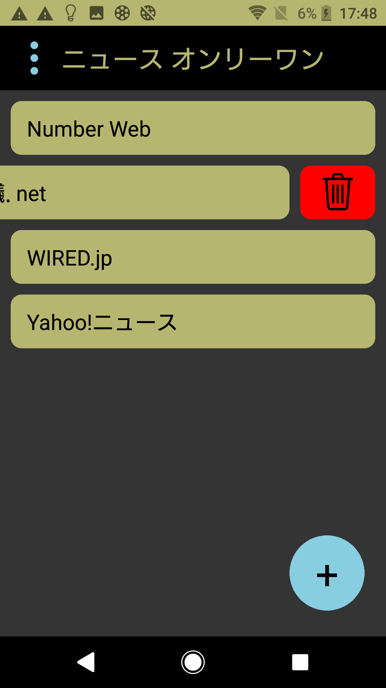                                                                  |

| Users can add news to their favorite list by simply pressing the 'heart' button. | They can also add news to their favorite list after accessing the news page by pressing the 'heart' button at the top right of the screen. |
| -------------------------------------------------------------------------------- | ------------------------------------------------------------------------------------------------------------------------------------------ |
| 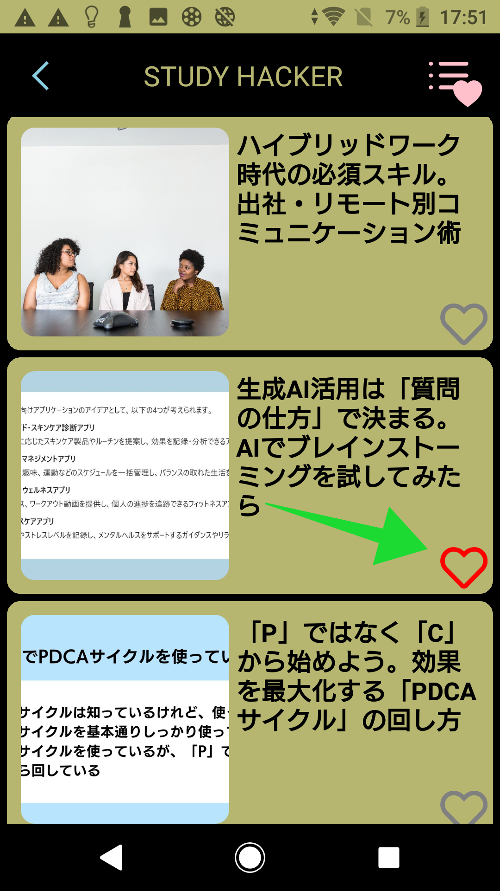                                         | 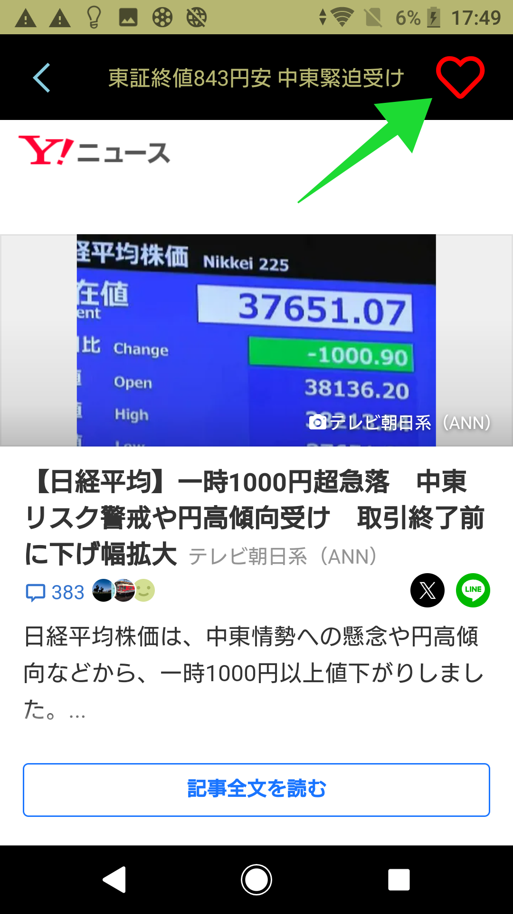                                                                                                   |

| Users can access their favorite list by pressing the 'Fav List' button at the top right of the page. | All news in the favorite list is highlighted in pink. |
| ---------------------------------------------------------------------------------------------------- | ----------------------------------------------------- |
| 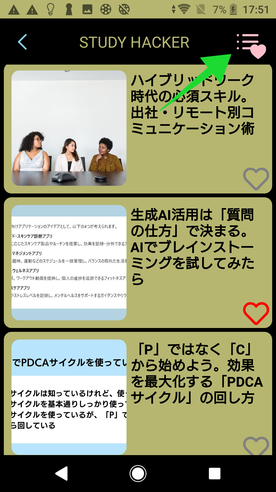                                                             | 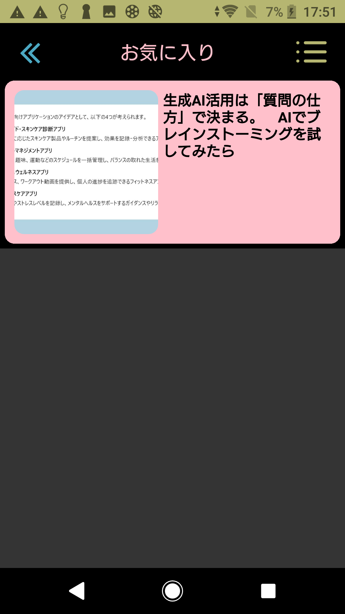              |

| Users can remove news from the favorite list by swiping the item to the left and pressing the bin button. | Users can also remove news from the favorite list after accessing the news page by pressing the bin button at the top right of the page. |
| --------------------------------------------------------------------------------------------------------- | ---------------------------------------------------------------------------------------------------------------------------------------- |
| 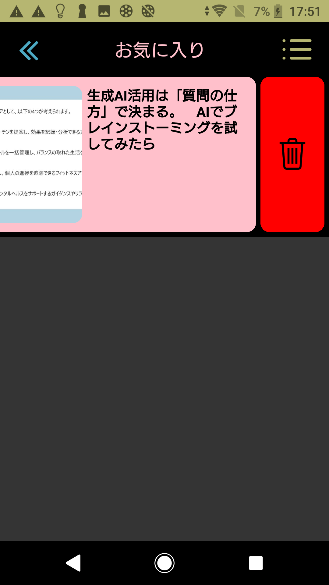                                                                  | 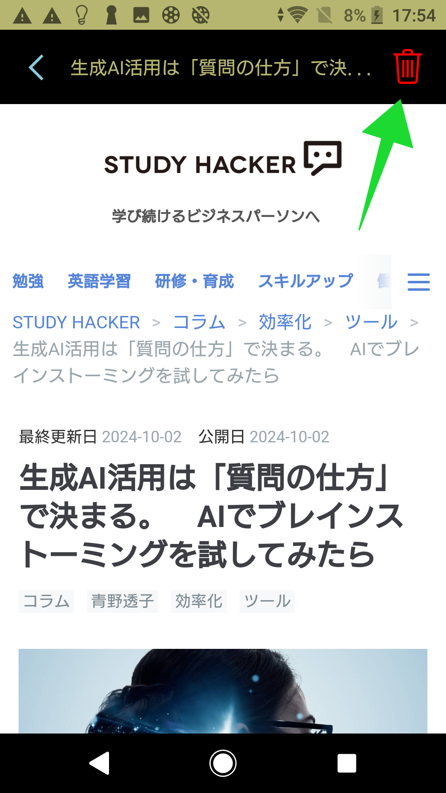                                                                                                |

| By pressing the three dots at the top left of the main page, users can access the settings page. | In the settings page, users can send feedback or bug reports. They can also suggest news sources they'd like to see added or request new features. |
| ------------------------------------------------------------------------------------------------ | -------------------------------------------------------------------------------------------------------------------------------------------------- |
| 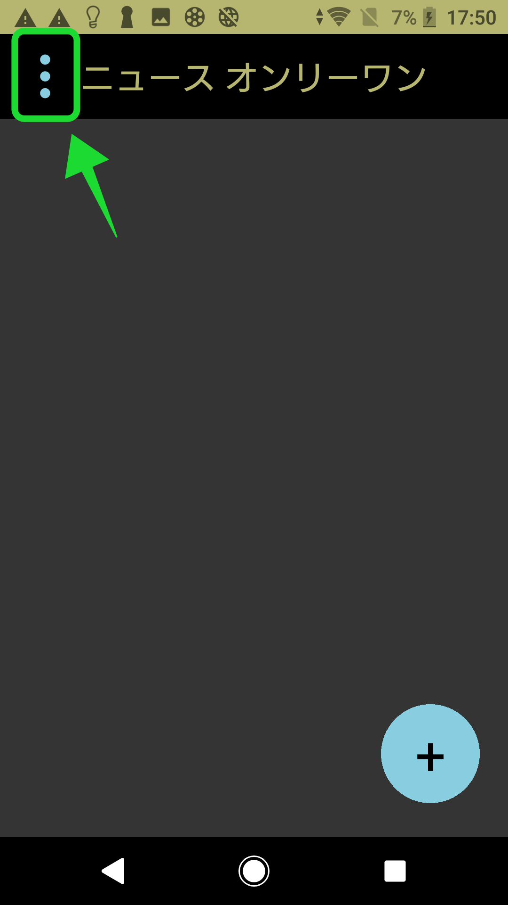                                                        | 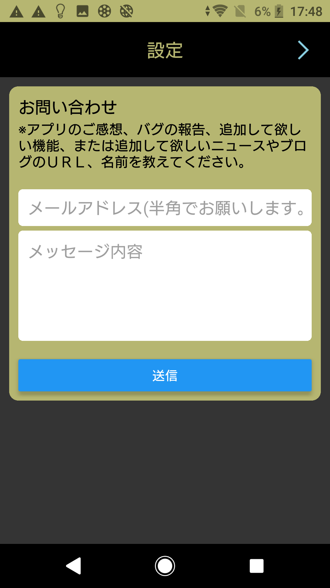                                                                                                          |

## Dependencies

    "@react-native-async-storage/async-storage": "1.23.1",
    "@react-navigation/bottom-tabs": "^6.6.1",
    "@react-navigation/native": "^6.1.18",
    "@react-navigation/native-stack": "^6.11.0",
    "@react-navigation/stack": "^6.4.1",
    "@types/react-native": "^0.73.0",
    "axios": "^1.7.3",
    "expo": "~51.0.24",
    "expo-status-bar": "~1.12.1",
    "fast-xml-parser": "^4.4.1",
    "he": "^1.2.0",
    "install": "^0.13.0",
    "latest": "^0.2.0",
    "npm": "^10.8.3",
    "react": "18.2.0",
    "react-native": "^0.74.5",
    "react-native-gesture-handler": "~2.16.1",
    "react-native-paper": "^5.12.5",
    "react-native-safe-area-context": "4.10.5",
    "react-native-screens": "3.31.1",
    "react-native-vector-icons": "^10.1.0",
    "react-native-webview": "13.8.6",
    "react-native-xml2js": "^1.0.3",
    "xml2js": "^0.6.2"

## Dev Dependencies

    "@babel/core": "^7.20.0",
    "@types/react": "~18.2.45",
    "@types/xml2js": "^0.4.14",
    "typescript": "~5.3.3"
