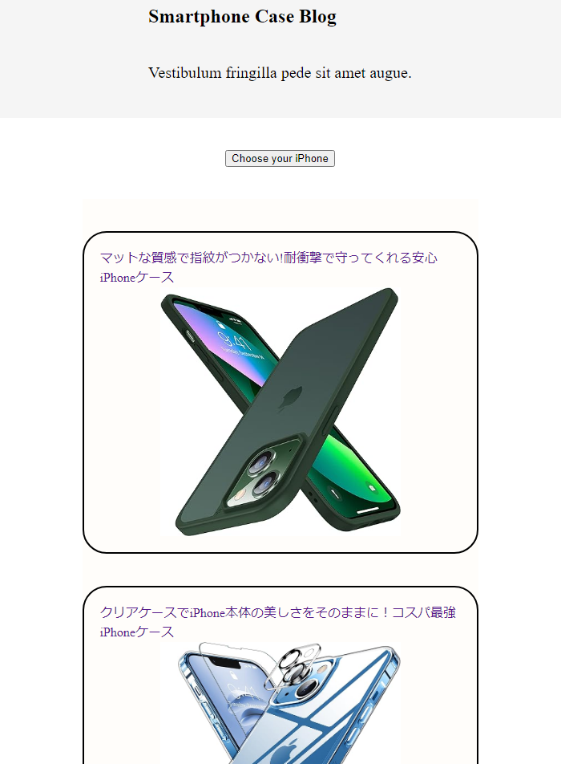
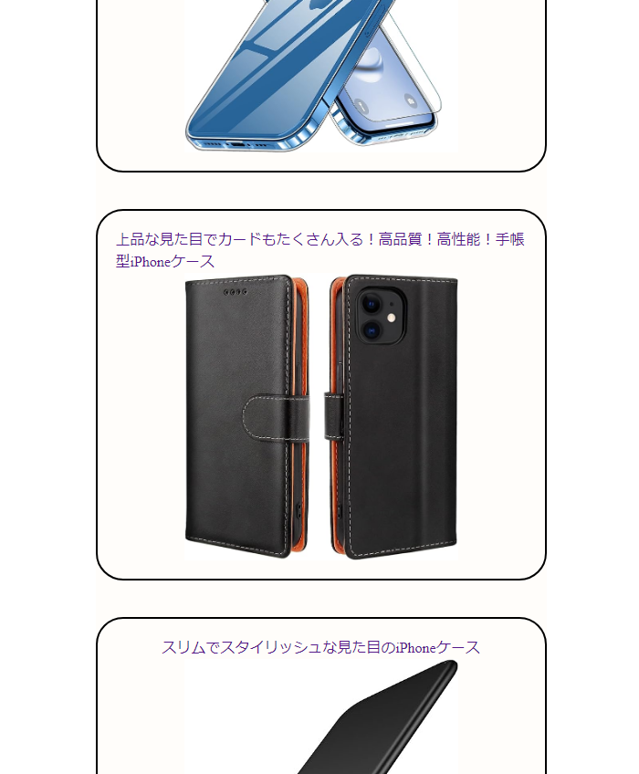
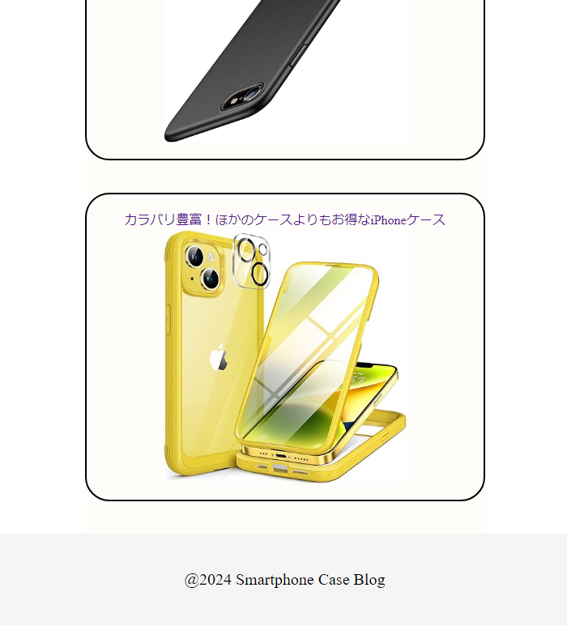
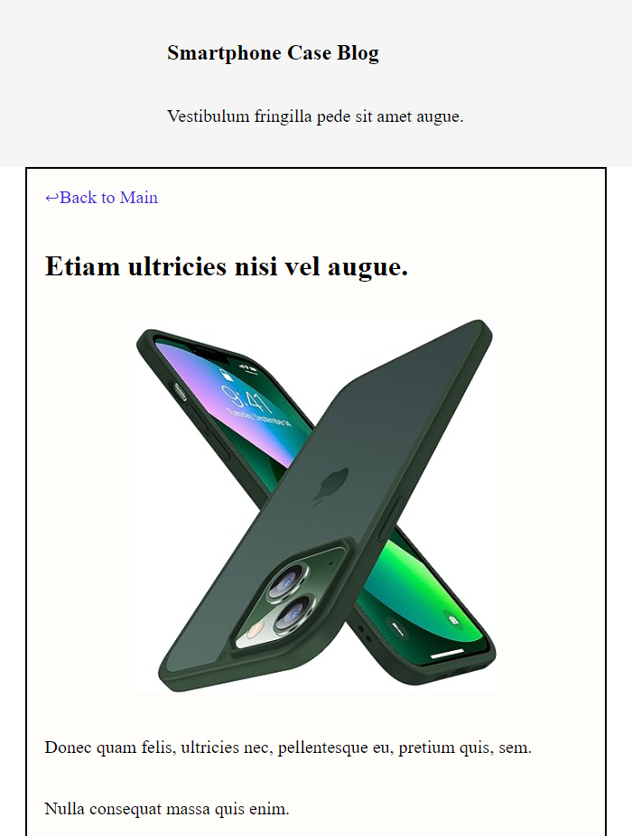
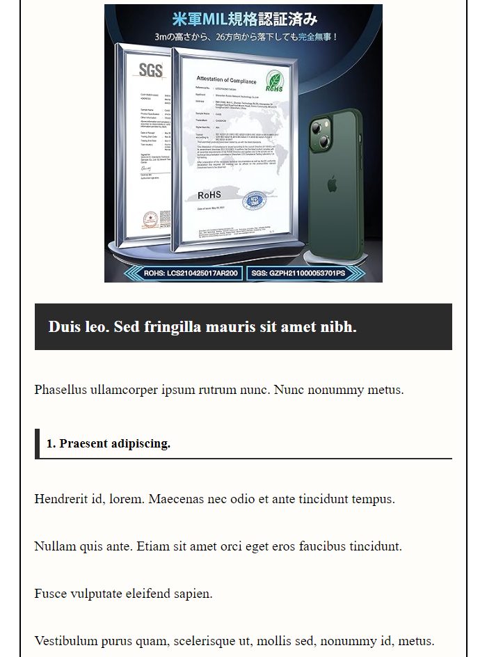
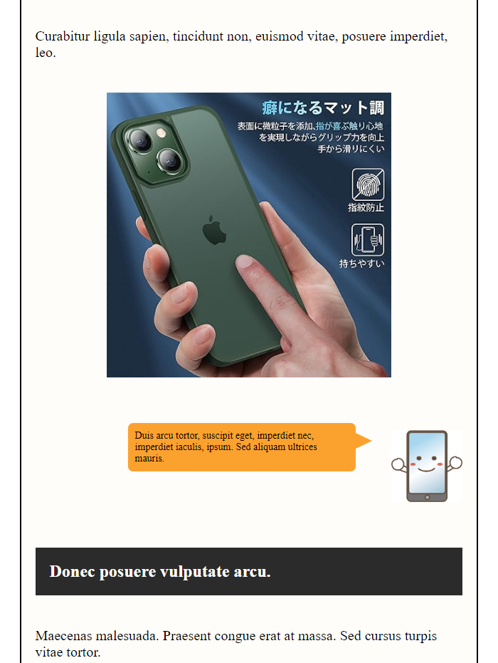
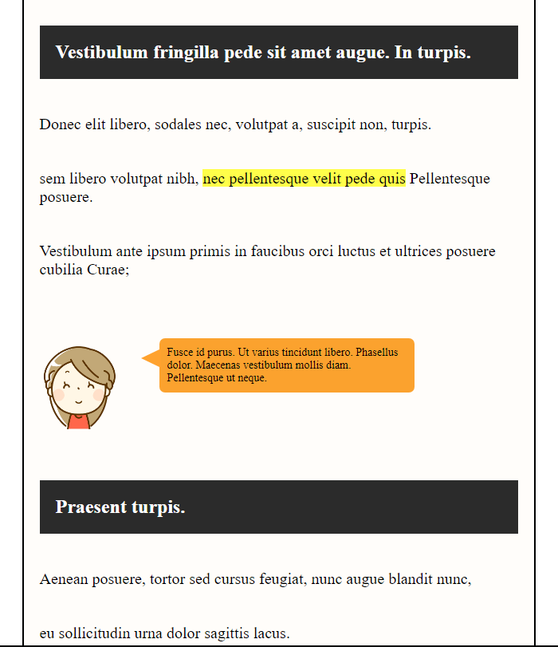
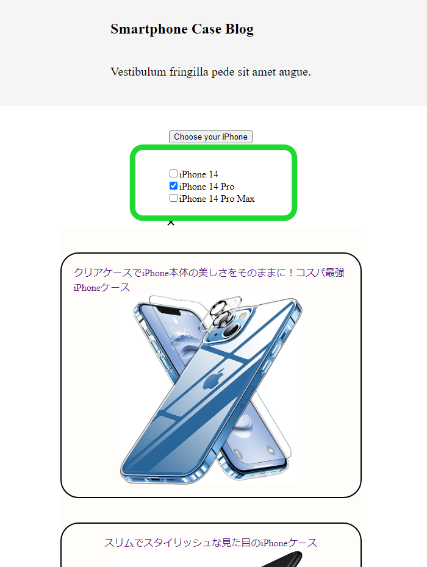
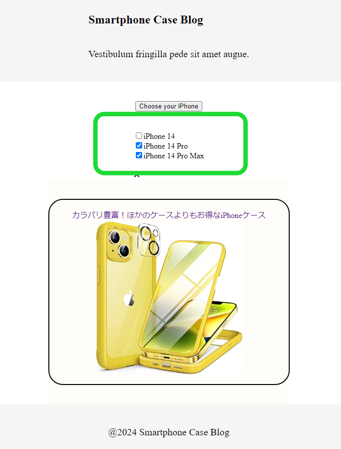

# Smartphone Case Blog  

----------------------------------------

[Software Name] Smartphone Case Blog   
[System Requirement] Windows 10  
[Version] 1.00  
[Last updated] 10/01/2024                                           

----------------------------------------

# Overview
This is the "Smartphone Case Blog," a platform where users can search for smartphone cases (iPhone cases). All the items are sourced from Amazon Japan, so anyone can purchase them.

# URL
https://portfolio-smartphone-case-blog.pages.dev/

# About this project
## What is 'Smartphone Case Blog'
At the 'Smartphone Case Blog,' there are summarized features of iPhone cases. Therefore, users can easily find their most suitable iPhone case.

## Why did you make it
There are many iPhone cases, and I've seen a lot of people asking, "Which iPhone case should I get?" So I decided to create this blog where I summarize the pros and cons of each iPhone case. Users can easily find their favorite iPhone case in this blog.

  
## Features
|Simple styles and multiple pictures are included in each blog. Users can easily visualize the appearance of the iPhone case.|
|----|
||

|Users can easily find their iPhone case models by simply clicking the radio buttons.|  
|----| 
||

## What I struggled with
To determine what kind of data needed to be stored in MongoDB was difficult in this project. Simply uploading the writings wouldn't include any styling effects. Therefore, I decided to upload the entire DOM to MongoDB. Fetching the data and bringing it to the frontend works perfectly. It took me a while to come up with this idea.

## Future Update
1. Add more and more blogs.  
Only five blogs are not enough. To make this web site more usefull for people, I need to write more blogs about the best iPhone cases.

1. Enable users to create their accounts and add a 'favorite' button to each iPhone case blog so that users don't have to find their favorite case again once they leave the website.  
Additionally, creating a comment box for each blog and allowing users to leave comments would improve the blog significantly.

# Frameworks, Skills, Libraries
## Dependencies
### Frontend
    "jwt-decode": "^3.1.2",
    "react": "^18.2.0",
    "react-dom": "^18.2.0",
    "react-router-dom": "^6.15.0"
### Backend
    "cors": "^2.8.5",
    "dotenv": "^16.3.1",
    "express": "^4.18.2",
    "jsonwebtoken": "^9.0.1",
    "mongoose": "^7.4.3"
## Dev Dependencies
### Frontend
    "@types/react": "^18.2.15",
    "@types/react-dom": "^18.2.7",
    "@vitejs/plugin-react": "^4.0.3",
    "eslint": "^8.45.0",
    "eslint-plugin-react": "^7.32.2",
    "eslint-plugin-react-hooks": "^4.6.0",
    "eslint-plugin-react-refresh": "^0.4.3",
    "vite": "^4.4.5"

# React + Vite

This template provides a minimal setup to get React working in Vite with HMR and some ESLint rules.

Currently, two official plugins are available:

- [@vitejs/plugin-react](https://github.com/vitejs/vite-plugin-react/blob/main/packages/plugin-react/README.md) uses [Babel](https://babeljs.io/) for Fast Refresh
- [@vitejs/plugin-react-swc](https://github.com/vitejs/vite-plugin-react-swc) uses [SWC](https://swc.rs/) for Fast Refresh

