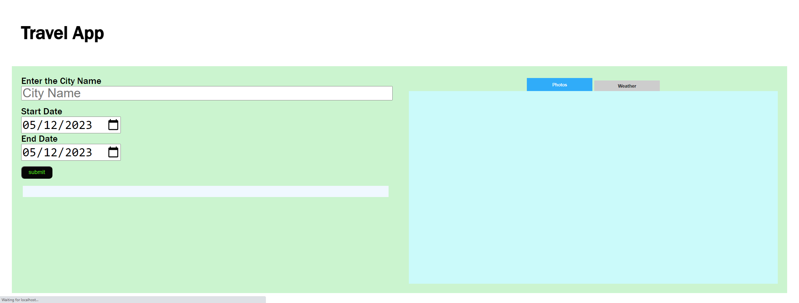

# Travel App
----------------------------------------

[Software Name] Travel App 
[System Requirement] Windows 10  
[Version] 1.00  
[Last updated] 9/05/2023

----------------------------------------
## About this project
This project is to build out a travel app that obtains a desired trip location & date from the user, and displays weather and images of the location using information obtained from external APIs.


## Skills
- node.js
- express
- webpack
- babel
- jest(test)

## How to Use the App

You need [node](https://nodejs.org/en/download/ "Node.js download page") to run this app.

If you have node installed in you local machine, 
run ```npm install``` to install all the packages you need to run this app.

Then, Run ```npm run build-prod``` in terminal.
(You will get a dist folder in your repository)

Open [http://localhost:8081](http://localhost:8081/) 

## Dependencies

    "body-parser": "^1.20.2",
    "cors": "^2.8.5",
    "dotenv": "^16.0.3",
    "express": "^4.18.2",
    "node-fetch": "^2.6.9",
    "webpack": "^5.76.2",
    "webpack-cli": "^5.0.1"

## Dev Dependencies

    "@babel/core": "^7.21.3",
    "@babel/preset-env": "^7.20.2",
    "babel-loader": "^8.3.0",
    "clean-webpack-plugin": "^4.0.0",
    "css-loader": "^6.7.3",
    "html-webpack-plugin": "^5.5.0",
    "jest": "^29.5.0",
    "mini-css-extract-plugin": "^2.7.5",
    "node-sass": "^8.0.0",
    "optimize-css-assets-webpack-plugin": "^6.0.1",
    "sass-loader": "^13.2.1",
    "style-loader": "^3.3.2",
    "terser-webpack-plugin": "^5.3.7",
    "webpack-dev-server": "^4.12.0",
    "workbox-webpack-plugin": "^6.5.4"