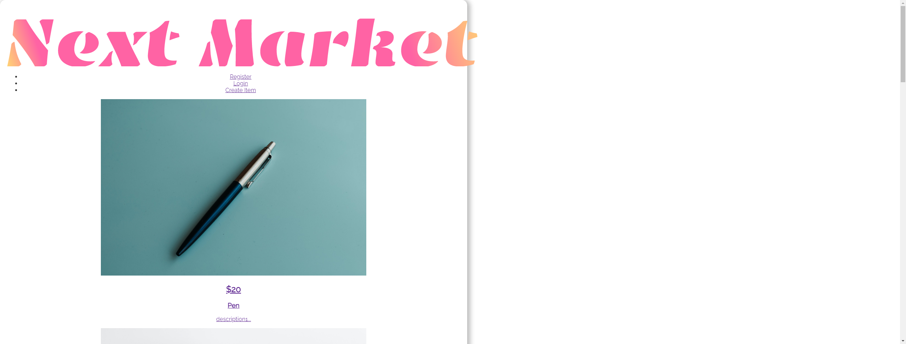
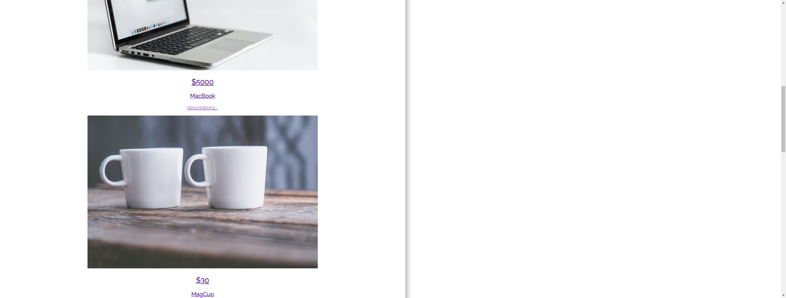

# fullstack(mern)

----------------------------------------

[Software Name] fullstack(mern)  
[System Requirement] Windows 10  
[Version] 1.00  
[Last updated] 9/05/2023  

----------------------------------------

# Overview

This project contains both frontend(React) and backend(node.js) codes.  
It also uses m: mongoDB, e: express, r: React, n: node.js 

This is a shopoing web site (Next Market) where users can selll their items. 
 
Only owner of the item can edit its page.  

# Instruction
1. Install all neccessary files into your pc by ```npm install``` in terminal
1. Open two terminals A and B
1. cd into mern-stack-frontend with terminal A
1. cd into mern-stack-backend with terminal B
1. ```npm start``` in terminal B (Start backend server)
1. ```npm start``` in terminal A (open website)
