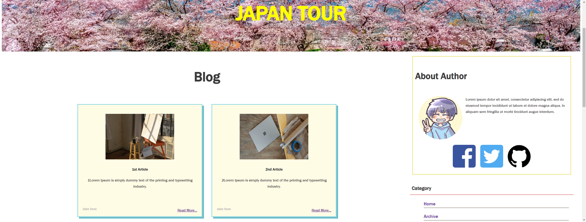

# myBlog

----------------------------------------

[Software Name] myBlog  
[System Requirement] Windows 10  
[Version] 1.00  
[Last updated] 12/05/2023  

----------------------------------------

## About this project
This project uses express, mongoDB, and ejs.  
I added new features to the project called ["PersonalBlog-HTML-CSS"](https://github.com/KohkiMartinez/My-Portfolio/tree/master/JavaScript/PersonalBlog-HTML-CSS "PersonalBlog-HTML-CSS page in Github") in this repository.  

I added:  
-backend server to connect with mongoDB  
-ejs files instead of HTML  
-login features (only logged in user can create/edit/delete article)
